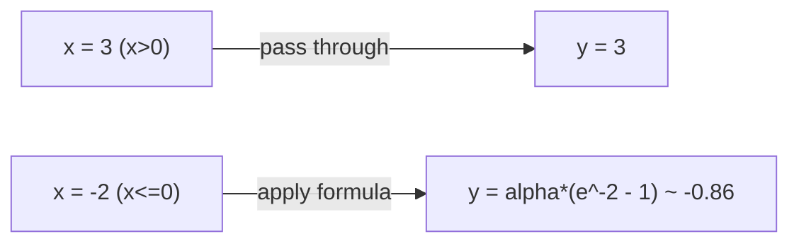
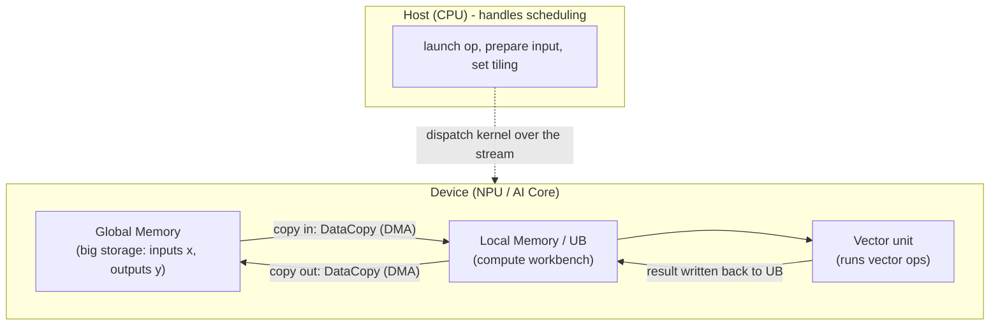
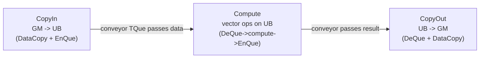
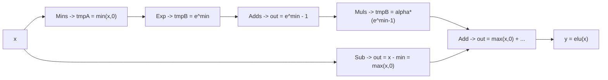
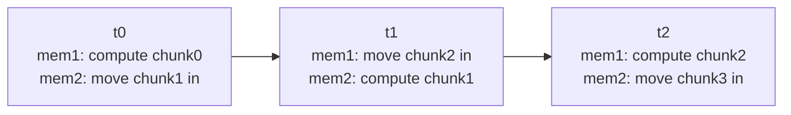
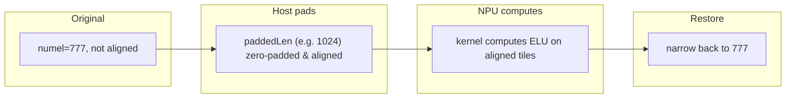

# Writing an Ascend C Operator From Scratch: the ELU Sample

> This hands-on tutorial takes you — even if you have never written an Ascend C
> operator before — through everything needed to write a real operator and let
> SGLang / PyTorch call it. Our example is the **ELU** activation, a purely
> element-wise operator. It is simple enough that you can focus on the
> *methodology* of Ascend C operator development instead of getting lost in a
> complex algorithm.
>
> The complete, compilable companion code lives under `csrc/elu/`, its test is
> `tests/python/sgl_kernel_npu/test_elu.py`. Reading this document side by side
> with that code works best.

---

## 1. Intuition first: what does this sample actually compute?

Every layer of a neural network calls functions that transform data, for
example turning every number of a matrix according to a formula. These units,
invoked over and over and each responsible for "applying one fixed computation
to a batch of data", are collectively called **operators** (OP).

ELU belongs to the family of *activation* operators. Mathematically it is
element-wise:

$$
\text{elu}(x) =
\begin{cases}
x, & x > 0 \\[4pt]
\alpha \cdot (e^{x} - 1), & x \le 0
\end{cases}
\qquad\qquad(\text{default }\alpha = 1.0)
$$

In plain words: **compute this once for every single number in the tensor.**



That is all. Yet "simplicity" is exactly what makes ELU a great first operator:
no cross-element dependency, no lookup, clean data boundaries — so you can spend
your energy on the **skeleton and workflow of Ascend C operator development**.

The interface we will end up with is callable like this:

```python
import sgl_kernel_npu
x = torch.randn(4096, device="npu", dtype=torch.float16)
y = torch.ops.npu.elu(x, 1.0)   # one line
```

---

## 2. Background: where does code actually run on an Ascend NPU?

Before writing an operator, keep a simple "hardware map" in mind. Three premises:

1. **CPU and NPU are two machines.** The conventional one is the **Host (CPU)**,
   which schedules, judges and dispatches; the one that does the heavy
   compute-dense (matrix/vector) work is the **Device (NPU)**. In
   `sgl-kernel-npu`, code that *launches / moves / schedules* runs on the Host
   (the **host code**), and code that *computes on each batch of data* runs on
   the Device (the **kernel code**).

2. **Compuation happens in the AI Core.** An NPU has many AI Cores that can
   run in parallel. Each AI Core contains several units; two matter here:
   - **Vector unit**: applies one vector operation to a whole row of data at
     once. ELU is a pure vector operator, so this is the one we use.
   - **Scalar unit**: handles address arithmetic, loops and control-flow — the
     "small stuff" (a bit like a tiny CPU).
   > There is also a **Cube unit** doing big matrix-multiply blocks; ELU does
   > not need it, ignore it for now.

3. **The NPU has two tiers of memory.** Data is not computed in place next to
   the compute unit; it must first be brought in.
   - **Global Memory (GM)**: large, slower; the input/output of an operator
     lives here.
   - **Local Memory (on-chip UB)**: small, fast; this is the "workbench" the
     compute unit really operates on.
   The AI Core can only compute on data in Local Memory, so data must
   constantly be moved between the two memory tiers.



> In one sentence: **operator = move data from the big storage to the small
> workbench -> compute on the workbench -> move the result back to the big
> storage.**

---

## 3. Assembling an ELU operator: the big picture

In `sgl-kernel-npu`, every operator is assembled from several parts. Here are
all the parts ELU needs, so you know the total count up front:

```text
csrc/elu/
├── op_kernel/
│   └── kernel_elu.cpp        # [Device] the code that actually computes ELU on the AI Core
├── op_host/
│   └── elu.cpp               # [Host]   launch the kernel, compute tiling, preprocess the input
└── README.md                 # this document

# A few "wiring" edits are also needed in shared files of the repository:
include/sgl_kenel_npu_ops.h      # declare the operator (advertise "this function exists")
csrc/pytorch_extensions.cpp      # register it as torch.ops.npu.elu (let PyTorch know it)
csrc/CMakeLists.txt              # tell the build system to compile these new .cpp files
tests/.../test_elu.py            # verify the operator is correct
scripts/run_kernel_tests.sh      # hook the test into the automated test group
```

Division of labor, once more:
- `op_kernel/*.cpp` are the parts that **compute on the NPU**;
- `op_host/*.cpp` and `pytorch_extensions.cpp` are the parts that **schedule on
  the CPU**.

The usual "bottom-up" order for writing an operator is:
**first write the kernel that computes ELU -> then use the host to feed it to
the NPU -> finally register it into the framework so the outside world can
call it.**

---

## 4. Step 1: write the kernel — the actual ELU computation (on the AI Core)

### 4.1 A kernel's fixed "skeleton"

Almost every simple Ascend operator uses one fixed template: **one class + one
entry function**.

- The **class** (we call it `KernelElu`) holds the operator's logic, split into
  two key members:
  - `Init(...)`: initialize — work out which data slice this core is
    responsible for, and allocate memory on the workbench (UB) for it;
  - `Process()`: the real main loop — bring data in, compute, and move the
    result out, repeatedly.
- The **entry function** (`elu_fp16` / `elu_fp32`) is the *door* through which
  the framework/NPU "calls your operator". It creates a class object and calls
  `Init` and `Process`.

The entry looks like this (seeing `extern "C" __global__ __aicore__` tells you
it is an entry):

```cpp
// One entry per data type. The compiler tool auto-generates the host-callable
// aclrtlaunch_*.h header from this function.
extern "C" __global__ __aicore__ void elu_fp16(
    GM_ADDR x,             // address of the input  x in Global Memory
    GM_ADDR y,             // address of the output y in Global Memory
    uint32_t totalLength,  // total number of elements to process
    uint32_t tileLength,   // how many elements are fetched per "chunk"
    float alpha)           // the coefficient alpha in the ELU formula
{
    KernelElu<half> op;    // build an operator object with half (= fp16)
    op.Init(x, y, totalLength, tileLength, alpha);  // initialize
    op.Process();          // go
}
```

Quick glossary of the qualifiers:
- `__global__`: tells the compiler this is a kernel function that can be
  launched from outside.
- `__aicore__`: tells the compiler this code runs on the AI Core.
- `GM_ADDR` is a macro equal to `__gm__ uint8_t* __restrict__`, meaning "a
  pointer into Global Memory".

### 4.2 Three memory objects: GlobalTensor / LocalTensor / Queue

Open `kernel_elu.cpp` and you will see it mostly manipulates three object
families. The fastest way to get unstuck is to tell them apart up front:

| Object | Memory | Plain explanation | Declaration example |
|---|---|---|---|
| `GlobalTensor<T>` | Global Memory | points at data in the "big storage"; readable & writable | `AscendC::GlobalTensor<T> xGm;` |
| `LocalTensor<T>` | Local Memory (UB) | a slice of the workbench; compute happens only here | `AscendC::LocalTensor<T> xLocal;` |
| `TQue<position, N>` | Local Memory | a "conveyor / queue" passing a chunk of data between CopyIn/Compute/CopyOut tasks | `AscendC::TQue<...VECIN, 2> inQueueX;` |
| `TBuf<position>` | Local Memory | private temporary memory of one task; not passed between tasks, just holds intermediates | `AscendC::TBuf<...VECCALC> tmpBufA;` |

### 4.3 A simple kernel's "big three": CopyIn → Compute → CopyOut

Ascend structures "processing data" as a **pipeline**, like a factory line —
when one station is done, the "half-product" is put on a conveyor for the next
station. The three stations are:



In the class these map to three private functions (`CopyIn`/`Compute`/
`CopyOut`), repeatedly looped by `Process()`. Because the data is large and "UB
cannot fit / finish it all at once", only a small chunk (`tileLength` elements)
is fetched at a time: fetch one, compute one, output one, looping `tileCount`
times to get the whole slice done.

```cpp
__aicore__ inline void Process()
{
    for (uint32_t i = 0; i < this->tileCount; i++) {
        CopyIn(i);    // copy chunk i from GM to UB, enqueue to inQueueX
        Compute();    // dequeue, run ELU, enqueue result to outQueueY
        CopyOut(i);   // dequeue result, copy it back to GM
    }
}
```

### 4.4 Reading the three small functions (key snippets)

**CopyIn: bring the input in.** `AllocTensor` grabs a slice of the workbench
from the queue, `DataCopy` moves the input in, then `EnQue` (enqueue) tells
Compute "the data is ready":

```cpp
__aicore__ inline void CopyIn(uint32_t progress)
{
    AscendC::LocalTensor<T> xLocal = inQueueX.AllocTensor<T>();   // grab a workbench slice
    AscendC::DataCopy(xLocal, xGm[progress * this->tileLength], this->tileLength); // copy in from GM
    inQueueX.EnQue(xLocal);                                       // enqueue, wait for Compute
}
```

**Compute: actually compute ELU.** This is the star of the show; the next
subsection covers it in detail. Here, just see how it talks to the queues:
`DeQue` (dequeue) gets the input, computes, then `EnQue` hands the result to
CopyOut; `FreeTensor` returns memory when done.

**CopyOut: move the output out.** `DeQue` takes the finished result and copies
it back to GM:

```cpp
__aicore__ inline void CopyOut(uint32_t progress)
{
    AscendC::LocalTensor<T> outLocal = outQueueY.DeQue<T>();               // take the finished
    AscendC::DataCopy(yGm[progress * this->tileLength], outLocal, this->tileLength); // copy back to GM
    outQueueY.FreeTensor(outLocal);                                        // return memory
}
```

### 4.5 The star: how Compute "translates" ELU into Ascend instructions

The problem: ELU's definition is **piecewise** (one recipe for x > 0, another
for x <= 0), but the Ascend vector unit **applies one single operation to a
whole slice of data and does not branch per element**. So what do we do?

**Trick: rewrite the piecewise function as one single formula.** Then, whether
x is positive or negative, everyone goes through the same expression — only an
intermediate result turns out to be 0 or e^x - 1. Using the small identity
$\max(x,0)=x-\min(x,0)$, ELU can be written without any `if`:

$$
\text{elu}(x)=\underbrace{\alpha\cdot\big(e^{\min(x,0)}-1\big)}_{\text{handles }x \le 0}+
\underbrace{\big(x-\min(x,0)\big)}_{=\;\max(x,0),\ \text{handles }x > 0}
$$

Ascend offers these as ready-made vector instructions; each one processes a
whole row at once. We break the formula into six instructions, passing
intermediate results along like a relay (two scratch workbench tensors `tmpA`,
`tmpB` hold the intermediates):

```cpp
// outLocal is the final output; tmpA/tmpB are two intermediate workbenches;
// n = tileLength (how many numbers are in this chunk)
AscendC::Mins (tmpA,     xLocal,   T(0),      n);  // tmpA = min(x,0)
AscendC::Exp  (tmpB,     tmpA,               n);  // tmpB = e^{min(x,0)}
AscendC::Adds (outLocal, tmpB,     T(-1),    n);  // out = e^{min(x,0)} - 1
AscendC::Muls (tmpB,     outLocal, alpha,    n);  // tmpB = alpha*(e^{min(x,0)}-1)
AscendC::Sub  (outLocal, xLocal,   tmpA,     n);  // out  = x - min(x,0) = max(x,0)
AscendC::Add  (outLocal, outLocal, tmpB,     n);  // out  = max(x,0) + alpha*(e^{min}-1) = elu(x)
```

This instruction chain can be drawn as a dataflow graph; every step is applied
to the whole row simultaneously:



**Why first take min(x,0) and then exp?** For x > 0 we do not need that branch,
and for x <= 0 the value of `exp(x)` stays between 0 and 1, so it can never
overflow — which keeps fp16 (with its limited range) safe.

That completes "one slice of the kernel". It simply: fetch a chunk, compute ELU
with the six instructions above, and move the result out — looping until the
whole slice is processed.

---

## 5. Step 2: initialization wiring — decide which "job" each core gets (Init)

We have seen `Process()` only "fetches / computes / sends". Deciding *which
slice to fetch and how big it is* is `Init()`'s job. `Init` computes, from the
number of parallel cores (`GetBlockNum`) and my own id (`GetBlockIdx`), **the
data interval this one core is responsible for**.

Analogy: a long street is to be cleaned in segments by N sweepers.
`GetBlockNum` tells you how many sweepers there are; `GetBlockIdx` tells you
your own number (0, 1, 2, …). Your interval is then fixed.

```cpp
__aicore__ inline void Init(GM_ADDR x, GM_ADDR y, uint32_t totalLength, uint32_t tileLength, float alpha)
{
    this->tileLength = tileLength;                        // remember how many elements per chunk
    this->alpha = static_cast<T>(alpha);                  // remember alpha

    uint32_t blockLength = totalLength / AscendC::GetBlockNum(); // elements shared per core
    this->tileCount = blockLength / tileLength;           // how many fetch rounds this core runs

    uint32_t blockOffset = blockLength * AscendC::GetBlockIdx(); // start offset of my interval
    // Point the GlobalTensors at the beginning of "my segment"
    xGm.SetGlobalBuffer((__gm__ T*)x + blockOffset, blockLength);
    yGm.SetGlobalBuffer((__gm__ T*)y + blockOffset, blockLength);

    // Allocate UB memory for the conveyor queues and the two intermediate workbenches
    pipe.InitBuffer(inQueueX, BUFFER_NUM, tileLength * sizeof(T));
    pipe.InitBuffer(outQueueY, BUFFER_NUM, tileLength * sizeof(T));
    pipe.InitBuffer(tmpBufA, tileLength * sizeof(T));
    pipe.InitBuffer(tmpBufB, tileLength * sizeof(T));
}
```

Look closely at `pipe.InitBuffer(...)`: the *input queue* `inQueueX` and the
*output queue* `outQueueY` pass `BUFFER_NUM` (= 2) as their second argument,
while the two scratch workbenches `tmpBufA`/`tmpBufB` do not (they get 1 slice).
Two important facts about Ascend operator design are hiding here.

**（1）Why give the queues two slices? — Double Buffering.**

Data movement (DMA) and vector computation (Vector) are **two independent task
pipelines** in hardware. If something both has to be *moved in* first and
*computed*, those two steps can naturally overlap. Once a queue has two slices,
the parallelism is easiest to see on one time axis — at every instant two
things happen *simultaneously* (one computes, one moves), on different data
chunks, while the two slices of memory alternate roles:



> Look at t0: at that same instant mem1 computes chunk0 while mem2 moves chunk1
> in — neither blocks the other. Walking t0 → t1 → t2, the Vector unit never
> stalls waiting for a move; the two slices just keep swapping roles.

- **The trouble with single buffering**: with only one slice of memory, nobody
  moves while computing and nobody computes while moving, so the Vector unit
  spends a lot of time idle, waiting on the copy.
- **The benefit of double buffering**: this one computes while that one moves,
  back and forth, hiding the copy time inside the compute time — Vector
  utilization and overall throughput clearly improve. Giving even more slices
  (3, 4, …) can fill the "move" pipeline more, but costs memory (see point (3)
  below).

**（2）Why do the two scratch workbenches have only one slice? — they never
enqueue downstream.**

`inQueueX`/`outQueueY` are "conveyors": one chunk flows CopyIn → Compute →
CopyOut, so it needs queue synchronization plus two slices to keep the relay
rolling. `tmpA`/`tmpB` are only *scratch private to one Compute call*, reused
right after the computation; **there is no hand-off between tasks**, so one
slice is enough — no need (and no reason) to give them two.

**（3）Wait — double buffering isn't free, is it? Where is the cost?**

Double buffering is *not* free. Beginners who only hear "it speeds things up"
tend to overuse it. The real costs:

- **It consumes more on-chip memory (UB).** The more slices, the fuller UB gets
  with queues. UB is finite; if queues hoard more, temporary space such as
  `tmpA`/`tmpB` may shrink, or each tile fits fewer elements — which can actually
  *increase* the number of copy rounds.
- **Scenarios where it can backfire:**
  - when the copy itself is already fast and the compute is slow (the data is
    bound by compute, not by moving): doubling the buffers saves almost no copy
    time yet wastes memory;
  - when the whole input is tiny and fits in one pass: extra slices are pure
    waste — which is exactly why `ComputeTileLength` in this sample caps the
    tile size (`TILE_ELEMS_CAP`) so a small input does not request a huge slab;
  - queue management and sync overhead also grow with the number of slices.
- So choosing the slice count is a **trade-off**, made by balancing "input
  size, how much time copy vs compute take, and how much UB is left" — not by
  blindly cranking `BUFFER_NUM`.

> Conclusion: this sample uses double buffering (`BUFFER_NUM = 2`) on the
> input/output queues, where "copy may be the bottleneck", and keeps the
> internal scratch buffers single — the common default, and a good example of
> "where doubling pays off and where it does not". As a beginner, just remember
> *double buffering = trading more UB memory for running copy and compute in
> parallel*, and you are good to go.

---

## 6. Step 3: the real "master slicing" — tiling a huge tensor (Host-side Tiling)

By now you may wonder: the kernel has been using `totalLength` and `tileLength`
all along — **who computes those numbers?** The answer: the **Host-side code**
in `op_host/elu.cpp`.

Ascend uses a term called **Tiling**: taking a big tensor that "cannot fit into
UB in one pass" and cutting it into many chunks that "each fit in one pass"
(each chunk is a tile), then deciding how to assign them. Roughly: **how much to
cut, how many cores, how much each core fetches per round — that "ruler" is what
Tiling decides.**

While slicing, three rules of Ascend must hold:

1. **32-byte alignment**: every segment's address on UB must be a multiple of
   32 bytes, so slicing starts, at minimum, at 32-byte granularity;
2. **memory-access optimization**: move as much as possible per round and fill
   UB up, to reduce the number of round trips (copying is the usual performance
   bottleneck);
3. **multi-core balance**: spread the work evenly across cores so no core is
   overloaded while others sit idle.

Host-side Tiling comes down to choosing `tileLength` (elements per chunk) and
`blockDim` (number of cores):

```cpp
// ---- decide "how big each chunk is" (a value that is aligned and fits, based
//      on UB capacity and the data type) ----
uint32_t tileLength = ComputeTileLength(x.element_size());

// ---- decide "how many cores": the needed tile count, but never more than the
//      hardware cores ----
int64_t numTiles = (numel + tileLength - 1) / tileLength;  // needed tiles (round up)
int64_t blockDim = std::min(coreNum, numTiles);            // cores used = the smaller one
```

`ComputeTileLength` roughly works like this (grasp the idea, not every detail):
after reserving a bit of UB for system overhead, divide by "how many bytes one
in-flight buffer needs" to find how many 512-element aligned slabs fit, then
cap the result so tiny inputs do not request a huge slab:

```cpp
// total in-flight buffers at once = 2 inputs + 2 outputs + 2 temporaries = 6 (when BUFFER_NUM=2)
uint64_t bytesPerUnit = 512 * elemSize * 6;
uint64_t alignUnits  = usableUb / bytesPerUnit;  // how many 512-slab fit
uint64_t tileElems   = alignUnits * 512;         // elements per chunk = slabs * 512
```

> Remember the split: **the Host decides how much to cut (and hands the kernel
> the ruler); the kernel just fetches / computes accordingly.**

---

## 7. Step 4: handling "not tidy" inputs — alignment and padding

So far we assumed "the total divides evenly and everything is tidy". In the
real world, what if a tensor has, say, 777 elements? Ascend needs 32-byte
alignment, and 777 is neither divisible nor aligned.

This sample uses an unhurried approach: **the Host "puts makeup on" the tensor
to make it tidy, then "takes the makeup off" after computing.**

- **Padding**: if `numel` is not an integer multiple of `blockDim × tileLength`,
  pad a few zeros so the padded length `paddedLen` gives every core exactly an
  integer number of tiles;
- **floor**: even if it is smaller than one tile, pad it up to one tile, so
  every core has work and is aligned;
- **"taking makeup off"**: the NPU returns the padded, longer array; the Host
  uses `.narrow(0, 0, numel)` to trim the extra tail, then `.view(x.sizes())`
  to restore the original (possibly multi-dimensional) shape, returning to the
  caller the array at its original length and shape.

  > Design detail: the kernel always treats the input as one linear `[numel]`
  > vector. So, before padding, the Host first flattens a multi-dimensional
  > input with `x.reshape({numel})` (zero-copy because the input is required to
  > be contiguous) and copies *that* into the 1-D zero-padded buffer. This
  > avoids a broadcast error when copying a multi-D tensor into a 1-D view and
  > keeps the restore step trivial thanks to the unchanged element count.

The benefit: the **kernel never needs the tricky "how to handle the leftover
tail" branch** (those are the easiest to get wrong) — clean logic. The cost: a
non-aligned input needs one extra padded copy. LLM activation tensors are
usually already aligned, in which case no padding happens at all and the
zero-overhead fast path is taken.

The benefit: the **kernel never needs the tricky "how to handle the leftover
tail" branch** (those are the easiest to get wrong) — clean logic. The cost: a
non-aligned input needs one extra padded copy. LLM activation tensors are
usually already aligned, in which case no padding happens at all and the
zero-overhead fast path is taken.

```cpp
// round up to a length giving every core an integer number of tiles
int64_t paddedLen = ((numel + perBlockElems - 1) / perBlockElems) * perBlockElems;
bool needsPadding = (paddedLen != numel);  // true means we have to pad
```



---

## 8. Step 5: feeding the kernel to the NPU — the Host launcher

Now that we have the kernel (how to compute on the NPU) and the Tiling (how to
slice), we need a **Host-side C++ function** that takes a PyTorch tensor `x`
and: validates the arguments -> flattens into a vector -> computes Tiling ->
actually launches the kernel -> returns the result.

Shown in outline:

```cpp
HOST_API at::Tensor elu(const at::Tensor &x, double alpha)
{
    // 1) validate: sensible input / contiguous / only fp16 & fp32 / finite alpha
    TORCH_CHECK(x.dim() >= 1,  "...");
    TORCH_CHECK(x.is_contiguous(), "...");
    TORCH_CHECK(dtype == at::kHalf || dtype == at::kFloat, "...");

    // 2) Tiling (section 6) -> tileLength, blockDim, paddedLen;
    //    if we need padding, copy x into xWork zero-padded to paddedLen

    // 3) launch the kernel — the core of it, one macro (details below)
    EXEC_KERNEL_CMD(elu_fp16, blockDim, xWork, yWork, totalLength, tileLength, alphaFloat);

    // 4) keep temporaries alive; if padded, trim back to the original length
    return yWork;   // (narrow(0,0,numel) when padded)
}
```

That `EXEC_KERNEL_CMD(...)` macro deserves a closer look — it packs a bunch of
low-level "launch a kernel on the NPU" steps **into one line**. It roughly does
three things:

1. fetches the **NPU queue stream** PyTorch is currently using;
2. converts the `at::Tensor`s you passed into the bare **device pointers** the
   NPU understands (`ConvertTypes`);
3. calls the Ascend launch API (`ACLRT_LAUNCH_KERNEL`) to run the entry
   function `elu_fp16` on `blockDim` cores.

> This also directly answers "why ELU now works on any shape": the Host has
> already flattened the shape into "one vector + the number of elements needed",
> so the kernel never cares how many dimensions the input originally had.

---

## 9. Step 6: making PyTorch know it — registering torch.ops.npu.elu

Once the C++ function `elu(...)` exists, PyTorch does not know it by default.
To call it from the outside as `torch.ops.npu.elu` we must **register** it:
tell PyTorch "there is an operator called `elu`, its arguments are so-and-so,
and this C++ function implements it." That mechanism is PyTorch's
**torch.library / custom-operator registration**; it comes down to two lines
(usually placed in `csrc/pytorch_extensions.cpp`):

```cpp
// 1) declare: define an operator elu, schema (Tensor x, float alpha) -> Tensor
m.def("elu(Tensor x, float alpha) -> Tensor");

// 2) implement: on the NPU backend (PrivateUse1) bind it to this C++ function
m.impl("elu", TORCH_FN(sglang::npu_kernel::elu));
```

The Python line then just works:

```python
import sgl_kernel_npu        # loads the .so, triggering the registration above
y = torch.ops.npu.elu(x, 1.0)
```

Overall, making an operator known and built by this repository usually touches
three places (which is exactly what ELU does):

1. `include/sgl_kenel_npu_ops.h` — declare `at::Tensor elu(...)`;
2. `csrc/pytorch_extensions.cpp` — the two registration lines above;
3. `csrc/CMakeLists.txt` — add `elu.cpp` (host) and `kernel_elu.cpp` (kernel)
   to the build.

---

## 10. Step 7: verifying correctness — designing the unit test

Writing the code is not the finish line. The thing newcomers most often
overlook is **verification**. The testing idea is:

> **Use a "slow but certainly correct" reference as the ground truth and compare
> the NPU result with it.**

The reference is just the PyTorch formula running on CPU, which is certainly
right:

```python
def elu_ref(x, alpha):
    # expm1(x) = e^x - 1, which avoids precision loss when x is near 0
    return torch.where(x > 0, x, alpha * torch.expm1(x))
```

Then compute on NPU and compare:

```python
y_npu = torch.ops.npu.elu(x.npu(), alpha).cpu()
torch.testing.assert_close(y_npu, elu_ref(x, alpha), atol=..., rtol=...)
```

`atol/rtol` are tolerances: because fp16 has limited precision, we allow a tiny
difference between the NPU result and our expectation, choosing a reasonable
tolerance (fp16 uses 1e-2, fp32 the tighter 1e-5).

Besides the "regular" shape (e.g. 4096 — aligned and the fastest path), the
tests deliberately cover many "awkward but real" cases:

| Case covered | Why |
|---|---|
| 4096 (aligned, large) | confirm the common fast path is right |
| 777 / a tiny tensor | trigger Host padding, verify the "makeup/remove-makeup" logic |
| custom alpha | verify the coefficient is passed correctly |
| very positive & very negative values (-30..30) | confirm exp does not overflow and the negative branch is right |
| empty input, unsupported dtype | confirm it neither crashes nor silently misbehaves, but errors properly |

Only after such a suite passes is the operator really "usable".

---

## 11. Putting it all together — and building/running it

As one relay chain, the whole loop looks like:


To actually run it on a machine (which needs an Ascend board with CANN
installed):

```bash
# 1) source the CANN environment
source /usr/local/Ascend/ascend-toolkit/set_env.sh

# 2) build the kernel library and install it as an importable wheel
cd sgl-kernel-npu
bash build.sh -a kernels
pip install output/sgl_kernel_npu*.whl --force-reinstall --no-deps

# 3) run the ELU unit test
python3 tests/python/sgl_kernel_npu/test_elu.py
```

If the mount/devices and ordinary Linux drivers are healthy, you will see all
tests PASS — that is, we wrote a complete Ascend operator "from zero to callable
in one line by `torch.ops.npu.elu`".

---

## Appendix: things left out here, but useful later

- **Why is a Queue a "conveyor" rather than a plain array?** A queue does
  synchronization between tasks by construction — `EnQue` is one task
  "handing off", `DeQue` is the next task "picking up". Ascend uses this to make
  sure two neighbor tasks never write to the same memory at odds.
- **What does Double Buffering actually buy?** It lets "moving data" and
  "computing data" run in parallel on different memory slices, like an extra
  buffer stage on an assembly line.
- **Why does the Host insist on 32-byte alignment and filling UP UB?** The UB
  and the copy hardware work at 32-byte alignment; moving more per round cuts
  the number of round trips sharply, and copying is the most common performance
  bottleneck in Ascend operators.
- **Headroom for generalization.** Currently fp16 and fp32 are supported. To add
  bf16, just cast to fp32 before `Exp` (Ascend's `Exp` has no native bf16) and
  cast back afterwards. For maximal performance you could add in-kernel
  tail-chunk handling (this sample sidesteps it with Host-side padding).

---

## References

- The CANN official course *Ascend C operator development (Kernel direct
  invocation)* — chapter 1 (Ascend C basics) and chapter 2 (Ascend C foundations):
  `tutorials/ascendc_operator_development_light/`.
- This operator's upstream repository: `sgl-project/sgl-kernel-npu`.
- The contribution guide: `docs/developer_guide/contribution_guide.md`.
- Ascend C API reference and the CANN installation guide (linked from the
  official course above).
